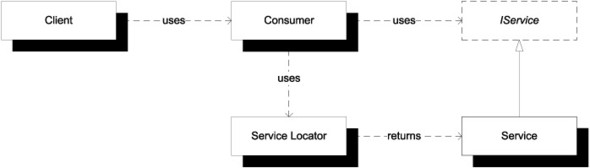

 En la versión que utilizaba singletons vimos que el build fallaba porque no teníamos forma de configurarle la referencia al mailSender. Una variante es implementar un [Service locator](https://www.geeksforgeeks.org/service-locator-pattern/), que consiste en tener un Singleton:

```kt
/**
 * El servide locator es un objeto con baja cohesión que permite un grado extra de indirección
 * para tener objetos muy frecuentemente usados que por esta naturaleza se vuelven globales.
 * En esta implementación se respeta una interfaz para cada referencia:
 * 1. tenemos que pasarle un objeto de tipo MailSender y
 * 2. esa referencia se inicializa tardíamente
 */
object serviceLocator {
    lateinit var mailSender: MailSender
}
```

Luego el MailObserver, en lugar de tener una referencia propia, va a usar la del service locator (así el mail sender queda "tercerizado")

```kt
class MailObserver : PostObserver {
    lateinit var prefijo: String

    override fun postEnviado(post: Post, listaCorreo: ListaCorreo) {
        serviceLocator.mailSender.sendMail(
            Mail(...
```

Es el test de expectativa (mock) debemos encargarnos previamente de asignar la referencia del service locator (o tendremos un error en runtime). Esta indirección es difícil de ver:

```kt
    describe("dada una lista de envio abierto") {
        val mockedMailSender = mockk<MailSender>(relaxUnitFun = true)
        val lista = ListaCorreo().apply {
            suscribir(Usuario(mailPrincipal = "usuario1@usuario.com"))
            ...
            agregarPostObserver(MailObserver().apply {
                // cambio la referencia (indirecta) en el service locator
                serviceLocator.mailSender = mockedMailSender
                prefijo = "algo2"
```

En cuanto al test de estado, como el stub es un singleton debemos enviar un mensaje reset() para evitar que el efecto colateral corte la independencia de nuestro test unitario:

```kt
    it("un usuario no suscripto puede enviar posts a la lista y le llegan solo a los suscriptos - prueba con stub fijo anda") {
        // cambio la referencia (indirecta) en el service locator y la reseteo para evitar efectos colaterales de otros tests
        serviceLocator.mailSender = stubMailSender
        stubMailSender.reset()
```

## Resumen

Muchas personas que desarrollan consideran al service locator como un [anti-pattern](https://blog.ploeh.dk/2010/02/03/ServiceLocatorisanAnti-Pattern/), señalando como desventajas

- que el objeto service locator es poco cohesivo (no tiene un objetivo definido y es en realidad un agrupador de servicios sin mucho criterio)
- tiene una indirección difícil de seguir (no es claro de ver que el test o la aplicación deben asignar el valor y los diferentes objetos de dominio accederlo)
- permite que la referencia sea modificada globalmente en cualquier momento, con lo que podemos tener efectos indeseados

Por otra parte, podemos conceder que tiene ventajas

- permite resolver la inyección de dependencias de manera simple, sobre todo cuando varios objetos tienen que compartir el mismo servicio
- es simple de implementar



[comment]: <> (TODO: Armar un diagrama propio)